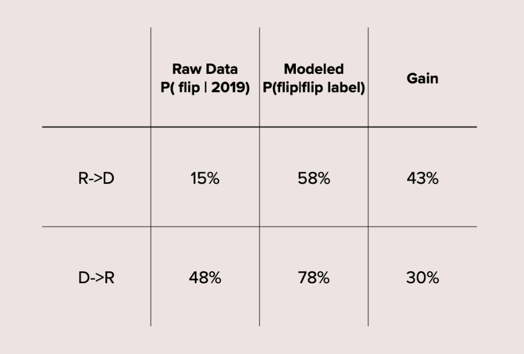

# precinct_flips
ML modeling of flips from R->D and D->R for Virginia precincts; for details see the full paper [here](https://github.com/Charlie-Kramer/precinct_flips/blob/main/flipping_districts.pdf) or the presentation [here](https://github.com/Charlie-Kramer/precinct_flips/blob/main/ISYE7406%20presentation.pdf). TLDR; modeling flips using machine learning techniques with demographic data results in a large increase in forecasting precision. 
